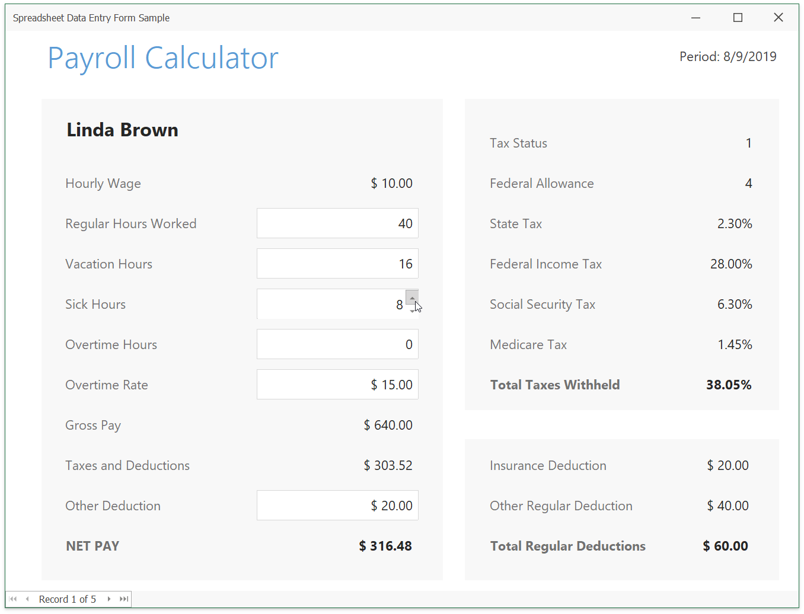

<!-- default badges list -->

<!-- default badges end -->
# How to Use Spreadsheet Control to Create a Data Entry Form

The following code example shows how to use the SpreadsheetControl to create a payroll data entry form. Users can enter payroll information (regular and overtime hours worked, sick leave and vacation hours, overtime pay rate, and deductions). Once data is entered, the Spreadsheet automatically calculates an employee’s pay and payroll taxes. The data navigator at the bottom of the application allows you to switch between employees.

# Files to Review

* [MainForm.cs](./CS/DataEntryFormSample/MainForm.cs) (VB: [MainForm.vb](./VB/DataEntryFormSample/MainForm.vb))
* [PayrollModel.cs](./CS/DataEntryFormSample/PayrollModel.cs) (VB: [PayrollModel.vb](./VB/DataEntryFormSample/PayrollModel.vb))
* [SpreadsheetBindingManager.cs](./CS/DataEntryFormSample/SpreadsheetBindingManager.cs) (VB: [SpreadsheetBindingManager.vb](./VB/DataEntryFormSample/SpreadsheetBindingManager.vb))

# More Examples

[How to Use SpreadsheetControl for WPF to Create a Data Entry Form](https://github.com/DevExpress-Examples/how-to-use-spreadsheetcontrol-to-create-a-data-entry-form)
